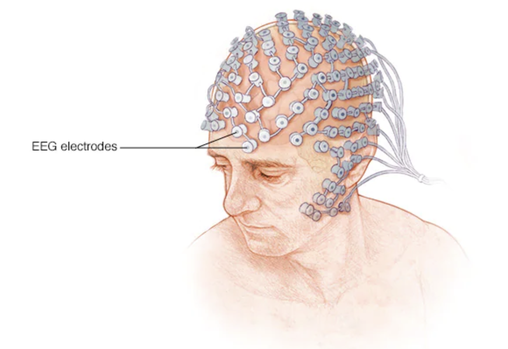
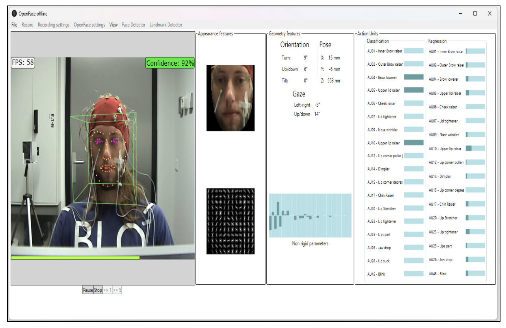
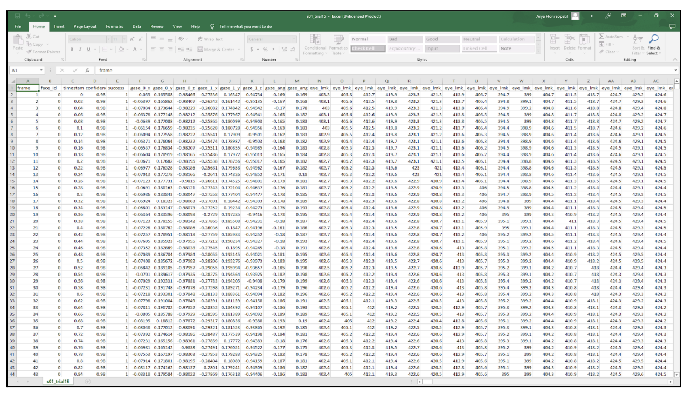
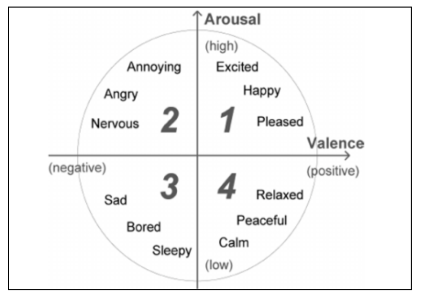
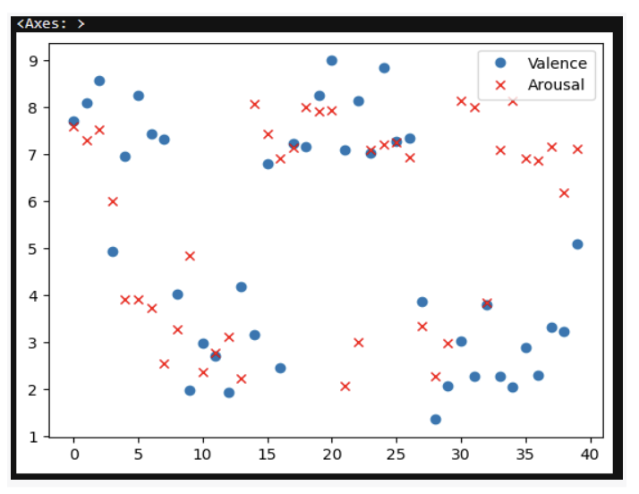
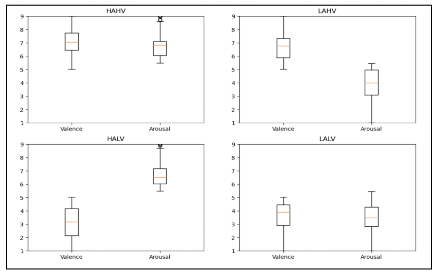
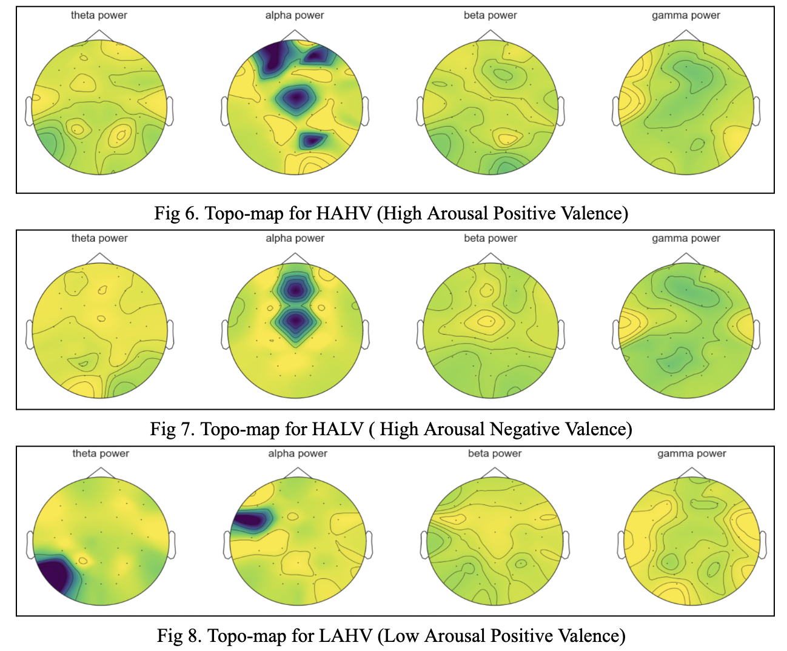
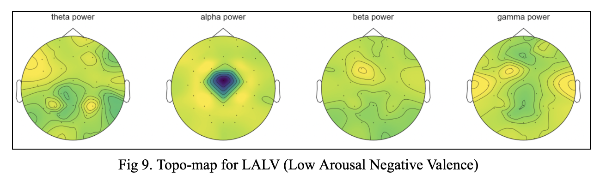

# EEG based Emotion Analysis

Fig taken from https://www.mayoclinic.org/tests-procedures/eeg/about/pac-20393875#dialogId17952831

## Introduction
This study makes use of the DEAP dataset[1], and machine learning models to perform EEG-based emotion classification. To perform emotion recognition using EEG signals we used machine learning algorithms such as K-nearest neighbor (KNN) and support vector machines (SVM) and used the OpenFace software to collect our ground truth for the machine learning algorithms. Emotions are intricate psychological states that are essential to how people behave, make decisions, and feel in general. Self-reporting is one of the more conventional ways to measure emotions, however, it can be biased and subject to subjectivity. Using the OpenFace software[2] to gather the ground truth for the emotion classification eliminates the bias and also removes the chance of subject-to-subjectivity.

## EEG for Emotions 
EEG signal-based emotion identification offers a precise and direct way to measure emotional states. EEG data provide a physiological viewpoint that enables researchers to record and examine the underlying neuronal processes connected to various emotions. This unbiased evaluation advances knowledge of emotions, their neurological underpinnings, and how they interact with cognitive functions. Through electrodes positioned on the scalp, EEG (electroencephalography) analyzes the electrical signals produced by the brain. Emotions are intricate psychological states that are essential to how people behave, make decisions, and feel in general. 

### EEG setup to collect brain signals

Fig taken from https://www.mayoclinic.org/tests-procedures/eeg/about/pac-20393875#dialogId17952831

## Dataset Description
We have downloaded our dataset from the official website[1]. After verifying the identity of the project members and understanding the motive behind the study, permission to access the dataset was given. The dataset contained preprocessed data in Matlab and Python. The dataset also consists of EEG (electroencephalogram) and peripheral physiological signals recorded from 32 participants (18 males, 14 females) between the ages of 19 and 37. The participants were presented with 40 one-minute music videos, each accompanied by an audio-visual stimulus. The videos covered a range of genres, including classical, rock, pop, and jazz. EEG signals were recorded using a BioSemi ActiveTwo system with 32 active electrodes placed on the scalp according to the 10-20 system. The signals were sampled at 512 Hz. The EEG data comprises a total of 40 trials, with each trial corresponding to a specific music video. The DEAP dataset[1] is organized into separate subject folders, each containing the participant's physiological data, self-report ratings, and annotations. The frontal face videos of 22 of the 32 participants are also recorded.

## Project Implementation
EEG data was gathered through the DEAP dataset website. For this project, we utilized the 1-minute frontal face videos for the 22 participants from the dataset. We used the OpenFace software[2] to calculate the valence and arousal values for each participant. The OpenFace software[2] gives values for different action units given below - AU1: Inner Brow Raiser, AU2: Outer Brow Raiser, AU4: Brow Lowerer, AU5: Upper Lid Raiser, AU6: Cheek Raiser, AU7: Lid Tightener, AU9: Nose Wrinkler, AU10: Upper Lip Raiser, AU11: Nasolabial Deepener, AU12: Lip Corner Puller, AU13: Cheek Puffer, AU14: Dimpler, AU15: Lip Corner Depressor, AU16: Lower Lip Depressor, AU17: Chin Raiser, AU18: Lip Pucker, AU20: Lip Stretcher, AU23: Lip Tightener. We use the values obtained as our ground truth for the machine learning models. And we used the preprocessed data to visualize the topo maps for the valence-arousal space. 

### OpenFace software processes the frontal face video of a participant

### CSV file generated by OpenFace software containing action units information

To get the valence and arousal values from the action units, we followed these steps: 1. We first defined the valence and arousal scales. 2. We identified the action units (AUs) from the data that are relevant for estimating valence and arousal. Combinations of AU1 (Inner Brow Raiser), AU12 (Lip Corner Puller), and combination of AU6 (Cheek Raiser), AU12 (Lip Corner Puller), and AU25 (Lips Part) were analyzed together for valence determination. Strong activation of these AUs is typically associated with positive valence, whereas reduced activation corresponds to negative valence. And combinations of AUs such as AU5 (Upper Lid Raiser), AU7 (Lid Tightener), and AU1 (Inner Brow Raiser)  were analyzed together, along with the combinations of AUs like AU25 (Lips Part) and AU20 (Lip Stretcher), and the combination of AU24 (Lip Pressor) and AU26 (Jaw Drop). Increased activation of these AUs tends to indicate higher arousal levels. After normalizing the selected AUs we assigned weights to each normalized AU based on their importance. 

Then we multiplied each normalized AU value by its corresponding weight and sum the weighted values to obtain a valence and arousal score for each person. Then we Interpreted the scores by considering the direction and magnitude of the values. Higher positive values on the valence scale represent more positive emotions, while higher values on the arousal scale indicate higher activation or intensity of emotions. The emotions were divided as shown in Figure 2 where valence and arousal are shown in a 2D space as described by [3]. 

### Russell’s 2D Emotion Model

### Valence and Arousal data points

### Box plot showing valence and arousal across the 22 participants

## Understanding Topo maps
Topo maps, also known as topographic maps, are visual representations that illustrate the spatial distribution of brain activity as measured by EEG signals. They provide a graphical depiction of the electrical activity across different regions of the scalp. Figures 6, 7, 8, and 9 show the activity inside the brain across the 4 waves (theta, alpha, beta, and gamma). The range for the electrical activity is from positive to negative 0 to 1. The positive 0 - 1 scale shows high activity and is depicted in dark blue and violet colors. The negative 0 -1 scale shows low activity and is depicted in lighter shades of green and yellow. 

The above topo-maps suggest that in the High Arousal Positive Valence space, there is activation seen for the alpha waves because it indicates that we are relaxed and happy. In the High Arousal Negative Valence, we also see activation for the alpha waves. But it has a different pattern than seen in the positive valence space. For both the topo-maps, the area near the occipital lobe is activated indicating that the brain is processing visual information. For the Low Arousal Positive Valence space, the theta and alpha waves are seen activated indicating a calm and relaxed state. In contrast, in the Low Arousal Negative Valence space, we can see very little activation in the central sulcus region indicating distressing or processing and integration of information related to movement and sensory perception. The topo-maps correctly indicate the emotional state across the different band powers (theta, alpha, beta, and gamma).

## Conclusion
In conclusion, the K-nearest neighbor (KNN) algorithm performed better than the support vector machines (SVM) with accuracy of 76.8% and 69.4% respectively because the the classes (happy, netral, sad) did not have a clear separation and overlapped. KNN makes predictions based on the nearest neighbors, so it can adapt to the local structure of the data even in such situations. Also, the data had a lot of outliers and KNN is robust to noisy data and outliers since it doesn't make any underlying assumptions about the data distribution. This outcome suggests that the KNN algorithm effectively handles the complex and non-linear decision boundaries present in the DEAP dataset. This study provides a stepping stone for future developments and breakthroughs in EEG-based emotion recognition using unbiased techniques like OpenFace software to decode emotions. 

## References:
[1]S. Koelstra et al., "DEAP: A Database for Emotion Analysis ;Using Physiological Signals," in IEEE Transactions on Affective Computing, vol. 3, no. 1, pp. 18-31, Jan.-March 2012, doi: 10.1109/T-AFFC.2011.15.

[2]https://github.com/TadasBaltrusaitis/OpenFace

[3] James A Russel, A_ective Space is Bipolar, University of British Columbia, Vancouver, Canada, Journal of Personality and Social Psychology 1979, Vol. 37, No. 3, 345-356.

